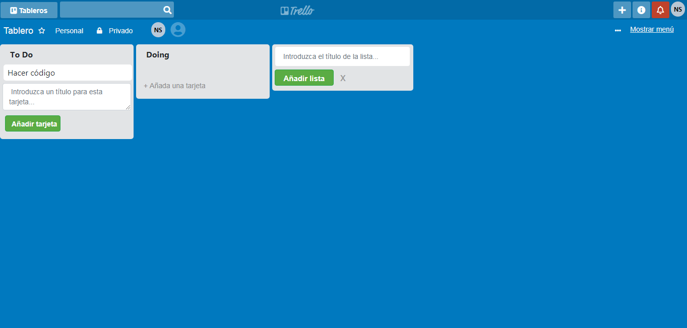

# Proyecto Trello

## Objetivo del proyecto

El objetivo de este proyecto fue replicar el diseño de la página original
de Trello.
Al entrar al link del proyecto puedes ingresar el título de una tarjeta y las
tareas asignadas a cada una.

## Link del proyecto
[Mi Trello](https://noeliasabando.github.io/Proyecto-trello/)

## Desarrollado para
[Laboratoria](http://www.laboratoria.la/)